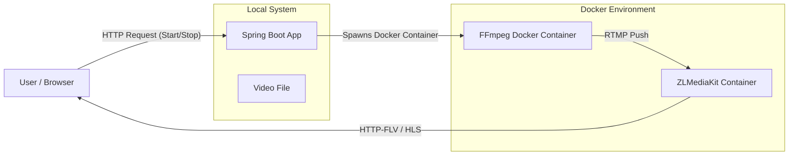

# Product Requirements Document (PRD): Local Video Streaming Service

## 1. Project Overview
This project aims to implement a local video streaming service using **Spring Boot**, **FFmpeg**, and **ZLMediaKit**. The system will allow users to stream local video files via RTMP to a media server (ZLMediaKit), which will then provide HTTP-FLV or HLS streams for playback in a web browser.

**Reference**: Based on the concept of "SpringBoot+FFmpeg+ZLMediaKit实现本地视频推流".

## 2. Objectives
-   Develop a RESTful API to control video streaming (start/stop).
-   Use **FFmpeg** to transcode/push local video files to **ZLMediaKit**.
-   Use **ZLMediaKit** as the streaming media server.
-   Provide a simple web interface to play the video stream using **flv.js**.
-   **Constraint**: All code, comments, and documentation must be in **English**.
-   **Constraint**: Use the latest stable versions of the technology stack.
-   **Constraint**: Run FFmpeg in a Docker container instead of local installation.

## 3. Technology Stack

| Component | Technology | Version (Target) |
| :--- | :--- | :--- |
| **Language** | Java | **21 (LTS)** |
| **Framework** | Spring Boot | **3.3.x** |
| **Build Tool** | Maven | 3.8+ |
| **Media Server** | ZLMediaKit | Latest Docker Image (`master`) |
| **Transcoder** | FFmpeg | **Docker Image (`jrottenberg/ffmpeg` or similar)** |
| **Process Mgmt** | Apache Commons Exec | 1.4.0 (or latest) |
| **Frontend** | HTML5, JavaScript | ES6+ |
| **Player** | flv.js | 1.6.x |

## 4. System Architecture



## 5. Functional Requirements

### 5.1. Backend (Spring Boot)
-   **Configuration**:
    -   Manage settings for ZLMediaKit host/port, FFmpeg Docker image, and video storage directory via `application.yml`.
-   **Stream Service**:
    -   `startStream(String videoPath, String streamKey)`:
        -   Verify video file existence on host.
        -   Construct **Docker** command to run FFmpeg:
            -   Mount host video directory to container volume.
            -   Connect to ZLMediaKit network (or use host networking).
            -   Push to `rtmp://<zlmediakit>/live/<streamKey>`.
        -   Execute Docker command asynchronously using `commons-exec`.
        -   Monitor process status.
    -   `stopStream(String streamKey)`:
        -   Terminate the specific Docker container/process associated with the key.
    -   `getStreamStatus(String streamKey)`:
        -   Return whether a stream is currently active.
-   **API Endpoints**:
    -   `POST /api/stream/start`: Accepts video filename and stream key.
    -   `POST /api/stream/stop`: Accepts stream key.
    -   `GET /api/stream/list`: Lists active streams.

### 5.2. Media Server (ZLMediaKit)
-   Run via Docker.
-   Expose RTMP (1935) for input.
-   Expose HTTP (80/8099) for HTTP-FLV/HLS output.
-   Configuration to manage latency and buffering (optimized for low latency).

### 5.3. Frontend
-   A simple HTML page.
-   Input fields for Stream Key and Video Filename (optional, or list available videos).
-   Video player container using `flv.js`.
-   Control buttons: Start Streaming, Stop Streaming, Play, Pause.
-   Status display (logs/alerts).

## 6. Implementation Plan

### Phase 1: Environment Setup
1.  **Docker**: Set up ZLMediaKit container.
    ```bash
    docker run -d -p 1935:1935 -p 8099:80 -p 8554:554 -p 10000:10000/udp --name zlmediakit zlmediakit/zlmediakit:master
    ```
2.  **FFmpeg Image**: Pull the FFmpeg image.
    ```bash
    docker pull jrottenberg/ffmpeg:4.4-ubuntu
    ```

### Phase 2: Spring Boot Project Initialization
1.  Initialize new Spring Boot 3.3.x project.
2.  Dependencies: `spring-boot-starter-web`, `lombok`, `commons-exec`.
3.  Create project structure: `config`, `service`, `controller`, `model`.

### Phase 3: Core Development
1.  **Config**: Implement `StreamConfig` to map `application.yml` properties.
2.  **Service**: Implement `StreamService` to construct `docker run` commands.
    -   *Crucial*: Handle volume mapping correctly so the Docker container can see the host files.
3.  **Controller**: Implement REST endpoints.
4.  **Exception Handling**: Global exception handler.

### Phase 4: Frontend & Integration
1.  Create `index.html` in `src/main/resources/static`.
2.  Implement `flv.js` logic to connect to ZLMediaKit's HTTP-FLV url.
3.  Connect UI buttons to Backend APIs.

## 7. Configuration Details

**application.yml** template:
```yaml
server:
  port: 8080

stream:
  zlm-host: localhost # Or Docker host IP if running in container
  rtmp-port: 1935
  http-port: 8099
  ffmpeg-image: jrottenberg/ffmpeg:4.4-ubuntu
  video-path: /Users/cui/Videos/      # Host path
  docker-video-mount: /videos         # Path inside FFmpeg container
```

## 8. FFmpeg Command Strategy (Dockerized)
We will use the following command structure:
```bash
docker run --rm \
  -v <host_video_path>:<docker_video_mount> \
  --network host \
  <ffmpeg_image> \
  -re -i <docker_video_mount>/<filename> \
  -c:v libx264 -preset ultrafast -tune zerolatency \
  -c:a aac -ar 44100 -b:a 128k \
  -f flv rtmp://<zlm_host>:<port>/live/<stream_key>
```
*Note: `--network host` is used for simplicity to access ZLMediaKit on localhost. Alternatively, use a shared Docker network.*
